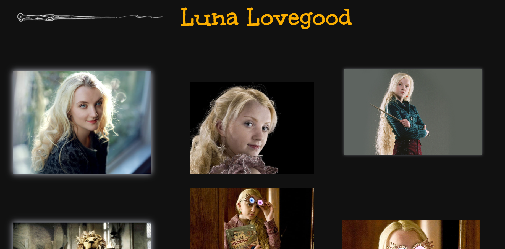

# Luna Lovegood's Angular Website


## 🌙 Introduction

The primary goal of this project is to gain hands-on experience with Angular and TypeScript, focusing on essential concepts like directives, routing and framework in general.

## 📱 Website Preview



## 🧙‍️ Prerequisitess

- This project was generated with [Angular CLI](https://github.com/angular/angular-cli) version 16.2.2.

- You need Node.js installed on your machine. You can download it from [nodejs.org](https://nodejs.org/).

## 🌟 Usage

Follow these steps to get this project up and running on your local machine:

1. **Clone the Repository**: Start by cloning this repository to your local machine using the following command:

   ```bash
   git clone https://github.com/the-physicist/angular-luna-lovegood.git
   ```

2. **Install Dependencies:** Open your terminal and navigate to the project directory. Run `npm install` to install the necessary dependencies.

3. **Run the Development Server:** In the terminal, execute `ng serve` to start the development server. Navigate to the website's address, typically `http://localhost:4200/`, after running the development server. Any changes you make to the source files will trigger automatic reloading.

4. **Explore the Website:** Open your web browser and go to `http://localhost:4200/` to explore Luna's magical world.

## 🌌 ️ Deployment

Run `ng build` to build the project. The build artifacts will be stored in the `dist/` directory.

## 🌈 Contributing

If you're interested in learning more about Angular or contributing to the development of this website, your participation is highly encouraged. You can contribute by opening issues, submitting pull requests, or engaging in discussions to enhance the website and make it even more feature-rich and user-friendly.

## 📝 License

This project is licensed under the MIT License - see the [LICENSE](LICENSE) file for details.
